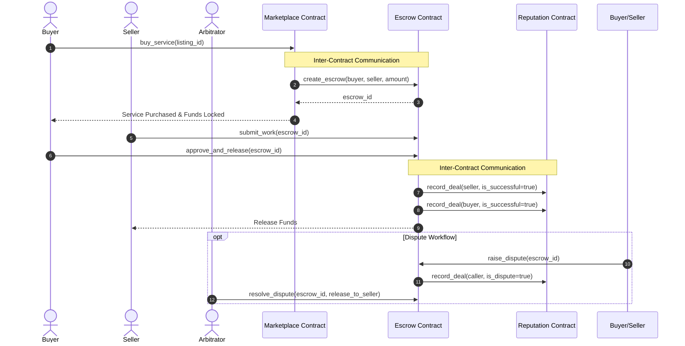

# 🛡️ Stellar Escrow Marketplace (Orange Belt Challenge)

> A production-ready, decentralized service & digital product marketplace built on **Stellar** with **Soroban smart contracts**, **inter-contract communication**, **dispute arbitration**, **reputation tracking**, **real-time event streaming**, and a **mobile-responsive React frontend**.

---

## 🚀 Submission Checklist & Verification

| Requirement / Item | Status | Details / Link |
| :--- | :---: | :--- |
| **Public GitHub Repository** | ✅ | [Stellar-OrangeBelt-Challenge](https://github.com/hrshjswniii/Stellar-OrangeBelt-Challenge) |
| **README & Complete Documentation** | ✅ | Architectural specs, setup guide, inter-contract diagrams |
| **Minimum 10+ Meaningful Commits** | ✅ | Granular feature, test, CI/CD, and docs commits |
| **Live Demo Link** | 🔗 | [LIVE_DEMO_LINK_PLACEHOLDER] |
| **Contract Deployment Address (Marketplace)** | 📜 | `[MARKETPLACE_CONTRACT_ADDRESS_PLACEHOLDER]` |
| **Contract Deployment Address (Escrow)** | 📜 | `[ESCROW_CONTRACT_ADDRESS_PLACEHOLDER]` |
| **Contract Deployment Address (Reputation)** | 📜 | `[REPUTATION_CONTRACT_ADDRESS_PLACEHOLDER]` |
| **Transaction Hash for Contract Interaction** | ⚓ | `[TRANSACTION_HASH_PLACEHOLDER]` |

---

## 📸 Screenshots & Verification Artifacts

### 1. Mobile Responsive UI


### 2. GitHub Actions CI/CD Pipeline Running


### 3. Smart Contract & Frontend Test Output (Passing Tests)


---

## 🌟 Key Features & Requirements Architecture

### 1. Advanced Smart Contract Development & Inter-Contract Communication
The platform decouples business logic across **3 inter-connected Soroban smart contracts**:
1. **`marketplace-contract`**: Manages service listings (`create_listing`, `buy_service`). Invokes the `escrow-contract` via cross-contract calls when a buyer purchases a listing.
2. **`escrow-contract`**: Locks XLM funds safely upon creation. Manages state machine transitions (`Funded` → `WorkSubmitted` → `Approved` / `Disputed` → `Resolved` / `Refunded`). Calls `reputation-contract` upon payment release or dispute resolution.
3. **`reputation-contract`**: Maintains trust ratings (0–100 score) for buyers and sellers based on successful completions vs. disputes.



### 2. Event Streaming & Real-Time Updates
Every state change publishes native Soroban contract events (`esc_init`, `wrk_sub`, `esc_appr`, `esc_disp`, `esc_res`, `rep_upd`). The frontend features a **Live Event Log Stream** that captures contract telemetry in real time.

### 3. CI/CD Pipeline Setup
GitHub Actions workflow (`.github/workflows/ci-cd.yml`) automates:
- Rust formatting check & compilation (`cargo check --all`).
- Soroban smart contract unit and integration testing (`cargo test --all`).
- WASM binary compilation (`cargo build --target wasm32-unknown-unknown --release`).
- Frontend linting, Vitest testing (`npm test`), and production build (`npm run build`).

### 4. Mobile Responsive Frontend & Wallet Integration
Built with **React**, **Vite**, and modern glassmorphism CSS aesthetics. Supports dual wallet modes:
- **Freighter Wallet** connection for Stellar Testnet interactions.
- **Interactive Mock Wallet** mode supporting seamless role-switching (Buyer, Seller, Arbitrator) for browser demo reviews without requiring browser extensions.

---

## 🛠️ Installation & Local Setup

### Prerequisites
- Node.js `v18+` & `npm`
- Rust `v1.80+` & `wasm32-unknown-unknown` target
- Cargo & Soroban CLI (optional for manual CLI deployments)

### 1. Clone & Install Dependencies
```bash
git clone https://github.com/hrshjswniii/Stellar-OrangeBelt-Challenge.git
cd Stellar-OrangeBelt-Challenge
npm install
```

### 2. Run Smart Contract Tests
```bash
cargo test --all
```

### 3. Run Frontend Unit Tests
```bash
npm test
```

### 4. Start Local Development Server
```bash
npm run dev
```
Open your browser at `http://localhost:5173`.

---

## 🚢 Smart Contract Deployment Workflow

To build WASM binaries and deploy contracts to Soroban Testnet:

```bash
# Make script executable
chmod +x scripts/deploy.sh

# Run deployment script
./scripts/deploy.sh testnet
```

---

## 📜 License

MIT License. Designed and developed as part of the Stellar RiseIn Orange Belt Challenge.
