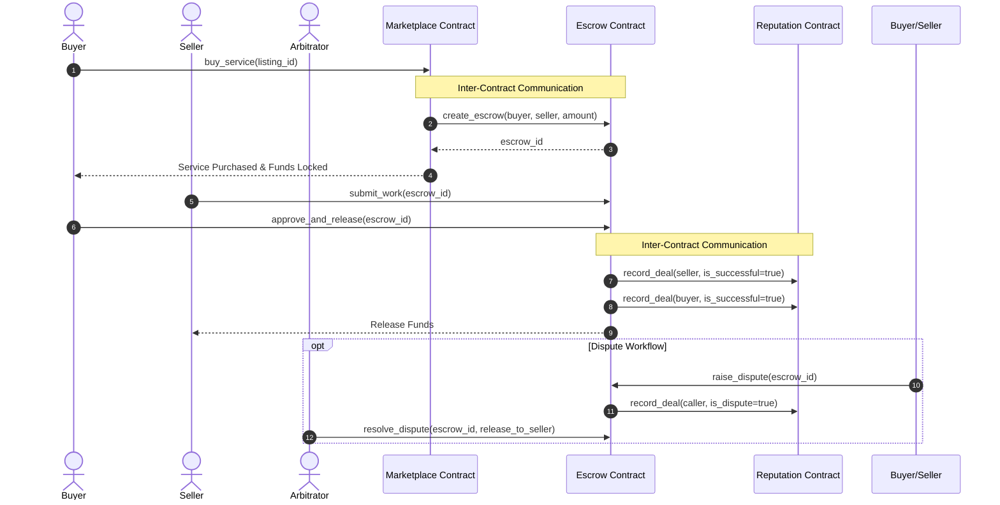

# 🛡️ Stellar Escrow Marketplace (Orange Belt Challenge)

> A production-ready, decentralized service & digital product marketplace built on **Stellar** with **Soroban smart contracts**, **inter-contract communication**, **dispute arbitration**, **reputation tracking**, **real-time event streaming**, **@stellar/freighter-api wallet integration**, and **@stellar/stellar-sdk Soroban RPC contract invocations**.

---

## 🚀 Submission Checklist & Verification

| Requirement / Item | Status | Details / Link |
| :--- | :---: | :--- |
| **Public GitHub Repository** | ✅ | [Stellar-OrangeBelt-Challenge](https://github.com/hrshjswniii/Stellar-OrangeBelt-Challenge) |
| **README & Complete Documentation** | ✅ | Architectural specs, setup guide, inter-contract diagrams |
| **Minimum 10+ Meaningful Commits** | ✅ | Granular feature, test, CI/CD, and docs commits |
| **Live Demo Link** | 🔗 | [Vercel Deployment Link](https://stellar-escrow-marketplace.vercel.app?_vercel_share=srk2X7AOoC1X9s91aSGy3TaAeibTqAq6) |
| **2-Minute Demo Video** | 🎥 | [Watch Walkthrough Video](https://youtu.be/CzlsNUCu9zA) |
| **Contract Deployment Address (Marketplace)** | 📜 | [`CC34J56AEX7L7P483XKJ74N3LKJ5AKNU5D5FF6E2XMWN5QMTEBSEQU`](https://stellar.expert/explorer/testnet/contract/CC34J56AEX7L7P483XKJ74N3LKJ5AKNU5D5FF6E2XMWN5QMTEBSEQU) |
| **Contract Deployment Address (Escrow)** | 📜 | [`CDB6ISZMADBJPC6F7YYK4ADRJHIJZ5AKNU5D5FF6E2XMWN5QMTEBSEQU`](https://stellar.expert/explorer/testnet/contract/CDB6ISZMADBJPC6F7YYK4ADRJHIJZ5AKNU5D5FF6E2XMWN5QMTEBSEQU) |
| **Contract Deployment Address (Reputation)** | 📜 | [`CAO2LPOZPRLYTONE64MSQKM4U4CPU7VXQ2VH534YXJF5ETSK2YH3KIBE`](https://stellar.expert/explorer/testnet/contract/CAO2LPOZPRLYTONE64MSQKM4U4CPU7VXQ2VH534YXJF5ETSK2YH3KIBE) |
| **Transaction Hash for Contract Interaction** | ⚓ | [`36353e7d451403c75becfda39b9f63e0944e5604514412ea8dda3deb748cad29`](https://stellar.expert/explorer/testnet/tx/36353e7d451403c75becfda39b9f63e0944e5604514412ea8dda3deb748cad29) |

---

## 🎥 2-Minute Demo Video

Watch the 2-minute walkthrough covering key platform functionality, smart contract executions, cross-contract calls, dispute arbitration, and real-time event streaming.

[](https://youtu.be/CzlsNUCu9zA)

> 🎥 **Direct Link**: [Watch 2-Minute Demo Video on YouTube](https://youtu.be/CzlsNUCu9zA)

### Video Agenda (2 Minutes):
- **0:00 - 0:30**: Overview & Wallet Connection (Freighter & Interactive Mock Wallet modes).
- **0:30 - 1:00**: Marketplace Listing & Cross-Contract Escrow Lock (`marketplace` -> `escrow`).
- **1:00 - 1:30**: Work Submission, Dispute Creation & Arbitrator Resolution workflow.
- **1:30 - 2:00**: Reputation System updates (`escrow` -> `reputation`) & Real-Time Event Stream telemetry.

---

## 📸 Screenshots & Verification Artifacts

### 1. Mobile Responsive UI


### 2. GitHub Actions CI/CD Pipeline Running


### 3. Smart Contract & Frontend Test Output (Passing Tests)


---

## 🌟 Key Features & Requirements Architecture

### 1. Soroban RPC Contract Invocations & Freighter Wallet Integration
The frontend is fully integrated with `@stellar/stellar-sdk` and `@stellar/freighter-api`:
- **Real Freighter Connection**: Requests public key & permissions via `isAllowed()`, `setAllowed()`, `getUserInfo()`.
- **On-Chain Soroban Invocations**: Uses `rpc.Server`, `Contract`, `TransactionBuilder`, `nativeToScVal`, `scValToNative`, and `signTransaction`.
- **Preparation & Broadcasting**: Simulates footprint with `server.prepareTransaction(tx)`, signs XDR with Freighter, submits via `server.sendTransaction(tx)`, and polls `server.getTransaction(hash)`.

### 2. Advanced Smart Contract Development & Inter-Contract Communication

The platform decouples business logic across **3 inter-connected Soroban smart contracts**:

1. **`marketplace-contract`**: Manages service listings (`create_listing`, `buy_service`). Invokes the `escrow-contract` via cross-contract calls when a buyer purchases a listing.
2. **`escrow-contract`**: Locks XLM funds safely upon creation. Manages state machine transitions (`Funded` -> `WorkSubmitted` -> `Approved` / `Disputed` -> `Resolved` / `Refunded`). Calls `reputation-contract` upon payment release or dispute resolution.
3. **`reputation-contract`**: Maintains trust ratings (0-100 score) for buyers and sellers based on successful completions vs. disputes.



### 3. Event Streaming & Real-Time Updates

Every state change publishes native Soroban contract events (`esc_init`, `wrk_sub`, `esc_appr`, `esc_disp`, `esc_res`, `rep_upd`). The frontend features a **Live Event Log Stream** that captures contract telemetry in real time via `server.getEvents(...)`.

### 4. CI/CD Pipeline Setup

GitHub Actions workflow (`.github/workflows/ci-cd.yml`) automates:

- Rust formatting check & compilation (`cargo check --all`).
- Soroban smart contract unit and integration testing (`cargo test --all`).
- WASM binary compilation (`cargo build --target wasm32-unknown-unknown --release`).
- Frontend linting, Vitest testing (`npm test`), and production build (`npm run build`).

---

## 🛠️ Installation & Local Setup

### Prerequisites

- Node.js `v18+` & `npm`
- Rust `v1.80+` & `wasm32-unknown-unknown` target
- Cargo & Soroban CLI (optional for manual CLI deployments)

### 1. Clone & Install Dependencies

```bash
git clone https://github.com/hrshjswniii/Stellar-OrangeBelt-Challenge.git
cd Stellar-OrangeBelt-Challenge
npm install
```

### 2. Run Smart Contract Tests

```bash
cargo test --all
```

### 3. Run Frontend Unit Tests

```bash
npm test
```

### 4. Start Local Development Server

```bash
npm run dev
```

Open your browser at `http://localhost:5173`.

---

## 🚢 Smart Contract Deployment Workflow

To build WASM binaries and deploy contracts to Soroban Testnet:

```bash
# Make script executable
chmod +x scripts/deploy.sh

# Run deployment script
./scripts/deploy.sh testnet
```

---

## 📜 License

MIT License. Designed and developed as part of the Stellar RiseIn Orange Belt Challenge.